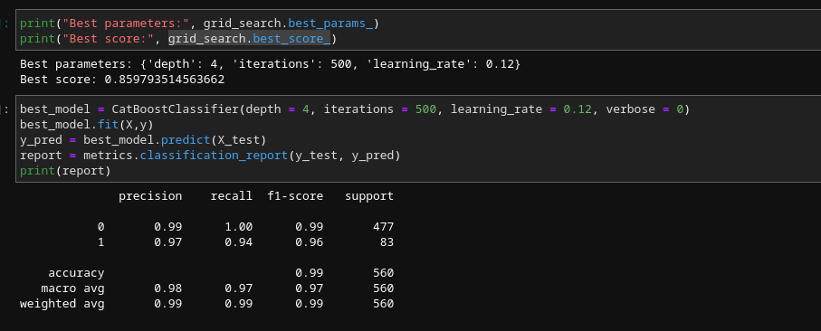
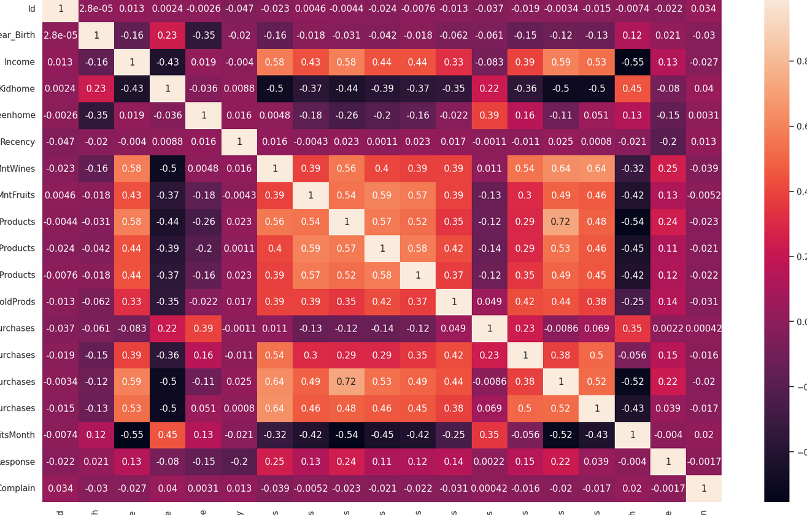
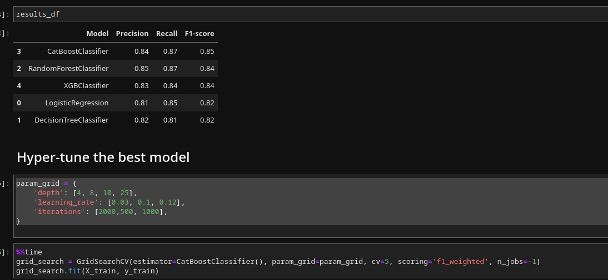

# Marketing Campaign


### Objective
The superstore is seeking to predict the probability of a customer providing a positive response and to determine the various factors that influence this response. Your task is to analyze the data given to identify these factors and subsequently construct a prediction model that can forecast the likelihood of a customer giving a positive response.


### Data
This data was gathered during last year's campaign. Data description is as follows
- Response (target) - 1 if customer accepted the offer in the last campaign, 0 otherwise
- ID - Unique ID of each customer
- Year_Birth - Age of the customer
- Complain - 1 if the customer complained in the last 2 years
- Dt_Customer - date of customer's enrollment with the company
- Education - customer's level of education
- Marital - customer's marital status
- Kidhome - number of small children in customer's household
- Teenhome - number of teenagers in customer's household
- Income - customer's yearly household income
- MntFishProducts - the amount spent on fish products in the last 2 years
- MntMeatProducts - the amount spent on meat products in the last 2 years
- MntFruits - the amount spent on fruits products in the last 2 years
- MntSweetProducts - amount spent on sweet products in the last 2 years
- MntWines - the amount spent on wine products in the last 2 years
- MntGoldProds - the amount spent on gold products in the last 2 years
- NumDealsPurchases - number of purchases made with discount
- NumCatalogPurchases - number of purchases made using catalog (buying goods to be shipped through the mail)
- NumStorePurchases - number of purchases made directly in stores
- NumWebPurchases - number of purchases made through the company's website
- NumWebVisitsMonth - number of visits to company's website in the last month
- Recency - number of days since the last purchase

### Models 


```python
    models = [LogisticRegression(),
          DecisionTreeClassifier(),
          RandomForestClassifier(),
          CatBoostClassifier(),
          XGBClassifier()]
    results_df = model_train(models, X_train, X_test, y_train, y_test)
```

### Data


#### Models Outcome



